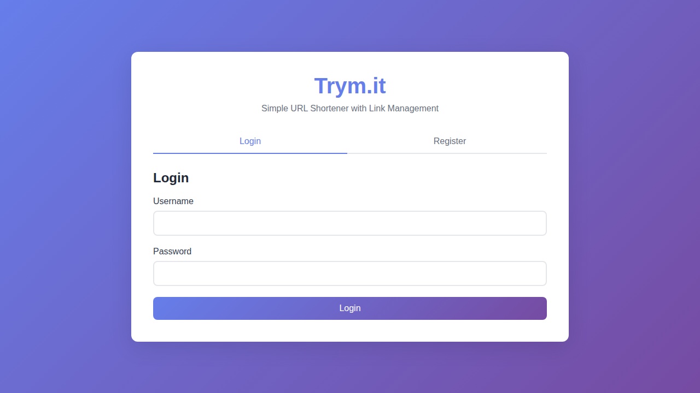
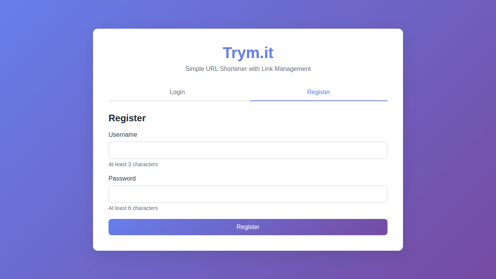
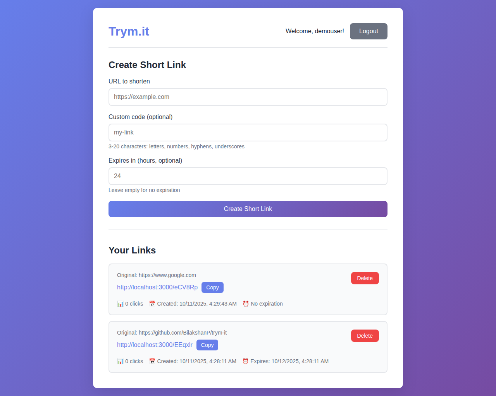

# Trym.it - URL Shortener

A simple, elegant URL shortener with user authentication and link management features.

Hosted at: [uca.bilakshan.dev](https://uca.bilakshan.dev/)



## Features

- **User Authentication** - Secure JWT-based authentication with login/register
- **Link Management** - Create, view, and delete short links
- **Link Expiry** - Set custom expiration times for links
- **Custom Short Codes** - Create memorable custom short codes
- **Click Tracking** - Track the number of clicks on each link
- **Modern UI** - Clean, responsive design with gradient theme
- **Fast & Lightweight** - Built with Express.js and vanilla JavaScript

## Screenshots

### Authentication



### Link Management



## Tech Stack

**Backend:**

- Node.js
- Express.js
- JWT for authentication
- bcrypt for password hashing

**Frontend:**

- HTML5
- CSS3 (with modern gradients)
- Vanilla JavaScript (no frameworks)

**Storage:**

- In-memory storage (for demo purposes)
- Can be easily replaced with a database

## Getting Started

### Prerequisites

- Node.js (v14 or higher)
- npm

### Installation

1. Clone the repository:

```bash
git clone https://github.com/BilakshanP/trym-it.git
cd trym-it
```

2. Install dependencies:

```bash
npm install
```

3. Create a `.env` file:

```bash
cp .env.example .env
```

4. Edit `.env` and set your JWT secret:

```env
PORT=3000
JWT_SECRET=your-secret-key-here-change-in-production
NODE_ENV=development
```

5. Start the server:

```bash
npm start
```

6. Open your browser and navigate to:

```
http://localhost:3000
```

## Usage

### Register/Login

1. Visit the homepage
2. Click on "Register" to create a new account (minimum 3 characters for username, 6 for password)
3. Or use "Login" if you already have an account

### Create a Short Link

1. After logging in, enter the URL you want to shorten
2. (Optional) Add a custom short code (3-20 characters)
3. (Optional) Set an expiration time in hours
4. Click "Create Short Link"
5. Your short link will appear in the "Your Links" section below

### Manage Links

- **Copy**: Click the "Copy" button to copy the short URL to your clipboard
- **Delete**: Click the "Delete" button to remove a link
- **Track**: View click counts and creation/expiration dates for each link

### Using Short Links

- Share your short link (e.g., `http://localhost:3000/abc123`)
- Anyone clicking it will be redirected to the original URL
- Clicks are tracked automatically

## API Endpoints

### Authentication

**POST** `/api/auth/register`

```json
{
  "username": "string",
  "password": "string"
}
```

**POST** `/api/auth/login`

```json
{
  "username": "string",
  "password": "string"
}
```

### Links (Requires Authentication)

**POST** `/api/links`

```json
{
  "url": "string",
  "customCode": "string (optional)",
  "expiresInHours": "number (optional)"
}
```

**GET** `/api/links`
Returns all links for the authenticated user.

**DELETE** `/api/links/:shortCode`
Deletes the specified link.

### Redirect

**GET** `/:shortCode`
Redirects to the original URL if the link exists and hasn't expired.

## Project Structure

```txt
trym-it/
├── server/
│   ├── index.js              # Express server setup
│   ├── middleware/
│   │   └── auth.js           # JWT authentication middleware
│   ├── routes/
│   │   ├── auth.js           # Authentication routes
│   │   └── links.js          # Link management routes
│   └── utils/
│       ├── storage.js        # In-memory storage
│       └── shortcode.js      # Short code generator
├── public/
│   ├── index.html            # Main frontend page
│   ├── 404.html              # Not found page
│   ├── css/
│   │   └── style.css         # Styles
│   └── js/
│       └── app.js            # Frontend JavaScript
├── .env                      # Environment variables
├── .gitignore               # Git ignore file
├── package.json             # Dependencies
└── README.md                # This file
```

## Security Features

- Passwords are hashed using bcrypt
- JWT tokens for secure authentication (7-day expiry)
- Input validation on both frontend and backend
- Protection against common attacks (XSS prevention in rendering)

<!-- ## Future Enhancements

- [ ] Database integration (MongoDB/PostgreSQL)
- [ ] QR code generation for links
- [ ] Analytics dashboard with charts
- [ ] Custom domains
- [ ] Link categories/tags
- [ ] Bulk link creation
- [ ] API rate limiting
- [ ] Email verification
- [ ] Password reset functionality
- [ ] Link preview/metadata

## Contributing

Contributions are welcome! Please feel free to submit a Pull Request.

## License

MIT License - feel free to use this project for personal or commercial purposes. -->
